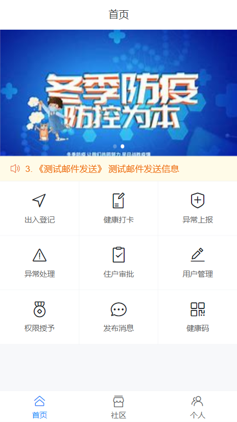
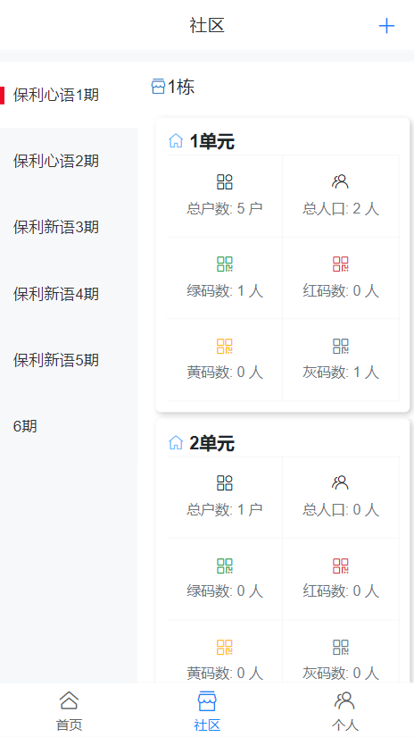
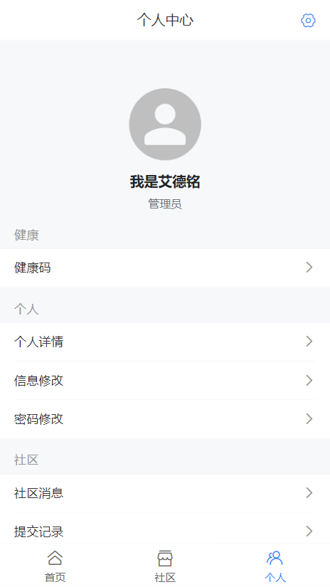
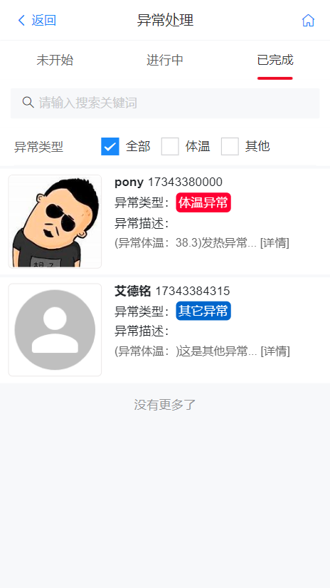
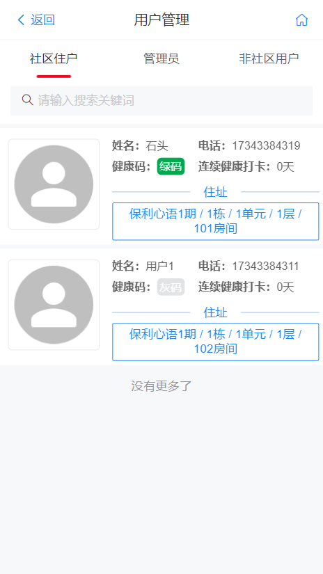
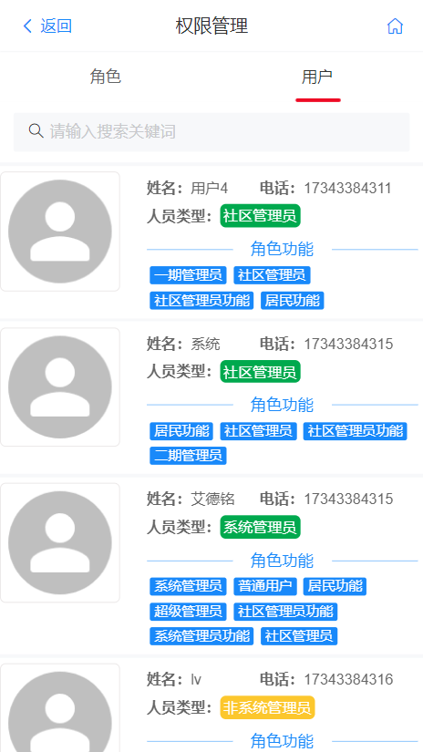
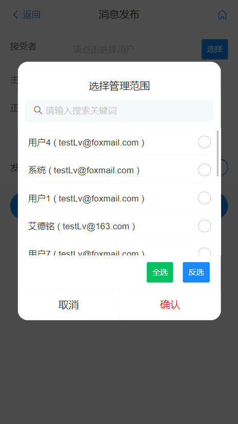
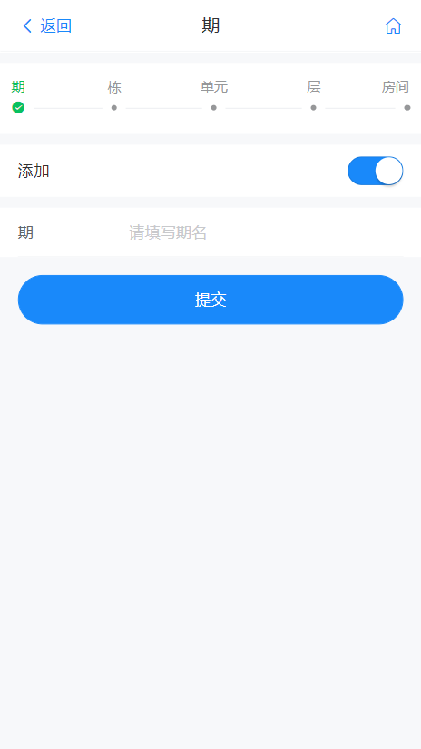
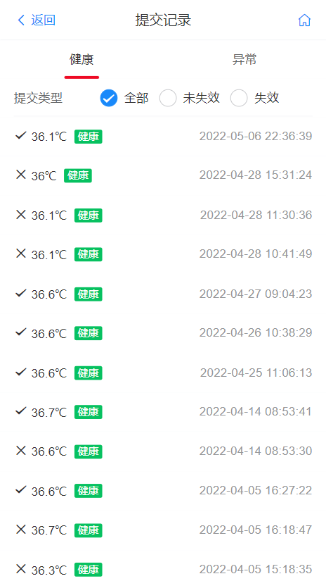

# 毕业设计——社区健康疫情防控系统
> 本人的毕业设计项目，持续更新中...

## 1. 项目说明

### 1.1 模块说明

1. web模块：项目的入口，通过该模块启动整个项目
2. commons模块：公共模块，系统的一些公共的工具类等
3. ahtuor模块：用户管理模块，负责系统用户的管理，以及权限的控制等
4. mail模块：负责系统内邮件通知
5. community模块：社区业务处理模块


### 1.2 架构说明

本系统使用的是SpringBoot+Vue框架的前后端分离项目，前端项目地址[lvyuanx/CommunitySystem-web (github.com)](https://github.com/lvyuanx/CommunitySystem-web)

#### 1.2.1 系统后端

系统后端使用SpringBoot框架，使用Mysql来实现数据的持久化，并且使用了MyBaitis-Plus进行数据桥接。整合了Shiro来进行权限控制，并且使用了Redis进行数据缓存极大提高了访问速度。

#### 1.2.2 系统前端

系统前端使用了Vue框架进行开发，使用了优秀的移动端UI框架Vant进行界面的美化，非常适合在移动端设备上进行操作。同时前端项目可以使用HbuildX打包成Andriod程序，来安装到手机上。


### 1.3 系统界面展示

| 首页                                                         | 社区                                                         | 个人中心                                                     |
| ------------------------------------------------------------ | ------------------------------------------------------------ | ------------------------------------------------------------ |
|  |  |  |
| 异常处理                                                     | 用户管理                                                     | 权限授予                                                     |
|  |  |  |
| 发布消息                                                     | 社区创建                                                     | 提交记录                                                     |
|  |  |  |


## 2. 启动说明

### 2.1 配置静态资源目录

> 本系统构建了一套本地文件上传下载服务，需要在配置文件中指定静态资源目录的位置，用于存放用户头像和网站的logo等图片。

**配置**

```yaml
lvyx:
  system:
    file-path: "/app/community_system_file" # 文件存储路径
    logo-path: "/app/community_system_file/STATIC/logo/logo.png" # logo存储路径
```

配置好静态资源路径后和网站logo路径后，请将项目中`web/resources/logo/logo.png`图片放置到对应位置，否则在使用健康码的时候无法加载网站logo导致二维码无法展示。

注意：路径可以写相对路径和绝对路径


### 2.2 数据库

系统数据库文件存放在`web/resource/l_coummunity.sql`位置，使用Navicat导入即可。

### 2.3 启动
* **idea启动**
  进入web模块下，使用`com.lyx.CommunitySystemApplication.java`主启动类，即可启动整个项目。

* **jar包启动**
  使用maven将项目打包成community_system.jar(可在web模块下的pom.xml中修改jar包名称)，运行一下命令即可完成启动：

  ```shell
  nohup java -jar community_system.jar > temp.log 2>&1 &
  ```

  